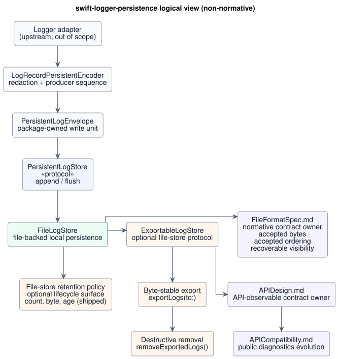

# Architecture

Non-normative system map for `swift-logger-persistence`.

## Scope

Layer map for local persistence APIs and file-backed storage only.
Normative persistence contract lives in
[`FileFormatSpec.md`](FileFormatSpec.md).

### M3.3.0 milestone shape

M3.3.0 establishes the local persistence API surface and storage model.

- `PersistentLogEnvelope` value type
- `PersistentLogStore`
- `LogRecordPersistentEncoder`
- `FileLogStore`
- Replay APIs are outside the M3.3.0 milestone scope. Export/remove
  lifecycle APIs are not replay APIs.

### Lifecycle additions

- M3.3.2 adds byte-stable export, destructive removal, and
  count-and-byte retention.

### Boundaries for later work

Deferred APIs and roadmap sequencing live in
[`README.md`](../README.md) and
[`ExportAndRemoveDesign.md`](ExportAndRemoveDesign.md).

## Non-goals

- Remote retry/backoff.
- Vendor request building.
- Network delivery.
- Exactly-once delivery.
- Storing raw sensitive data by default.

## Layering

- API layer: [`APIDesign.md`](APIDesign.md).
- Format/spec layer: [`FileFormatSpec.md`](FileFormatSpec.md).
- Compatibility layer: [`APICompatibility.md`](APICompatibility.md).
- Implementation layer: `Sources/` and `Tests/`.

For persistence contract, the format/spec layer outranks API prose; on
conflict, [`FileFormatSpec.md`](FileFormatSpec.md) prevails.

## Package & product split

The package exposes two products:

- `LoggerPersistence` -- protocols, envelope model, and record-aware
  encoder.
- `LoggerFilePersistence` -- file-backed implementation
  (`FileLogStore`, `FileLogStore.Configuration`).

See [`Decisions/0001-package-split.md`](Decisions/0001-package-split.md).

## Logical view

```
Logger adapter
   |
   v
encoder/redactor (LogRecordPersistentEncoder, or caller-owned)
   |
   v
PersistentLogEnvelope
   |
   v
PersistentLogStore  (protocol)
   |
   v
FileLogStore        (concrete store; file-backed local persistence)
```

The companion PlantUML diagram is non-normative and mirrors this
layer map for visual review only
([source](Resources/PersistenceLogicalView.puml)).

[](Resources/PersistenceLogicalView.svg)

Ownership boundaries:

- The **adapter** is upstream and out of scope for this package.
- The **encoder** owns redaction and sequence assignment.
- The **envelope** is the write unit accepted by stores before
  file-format encoding.
- The **store** owns local file I/O, not payload decoding or vendor
  delivery.
- Application-managed encryption-at-rest, tamper-evident record
  chains, remote or SIEM shipping, and operating-system file-access
  enforcement are caller/platform responsibilities outside this
  package.
- Replay file-format and byte-stable export contracts are defined in
  [`FileFormatSpec.md`](FileFormatSpec.md), which remains the
  normative source.
- Stores preserve producer sequence metadata without assigning it.

See [`Decisions/0002-envelope-storage.md`](Decisions/0002-envelope-storage.md)
and [`Decisions/0004-ordering-model.md`](Decisions/0004-ordering-model.md).

## Failure model

Store APIs are `async throws`; public store implementations may narrow
their contracts with typed throws for public persistence errors without
requiring exhaustive enum matching.
Logger-facing adapters remain infallible by design. Adapter diagnostics
are non-normative and non-authoritative, and adapter retry policy is
outside the persistence contract and package scope; retry belongs to
the upstream adapter/app layer. See
[`Decisions/0005-failure-model.md`](Decisions/0005-failure-model.md).
